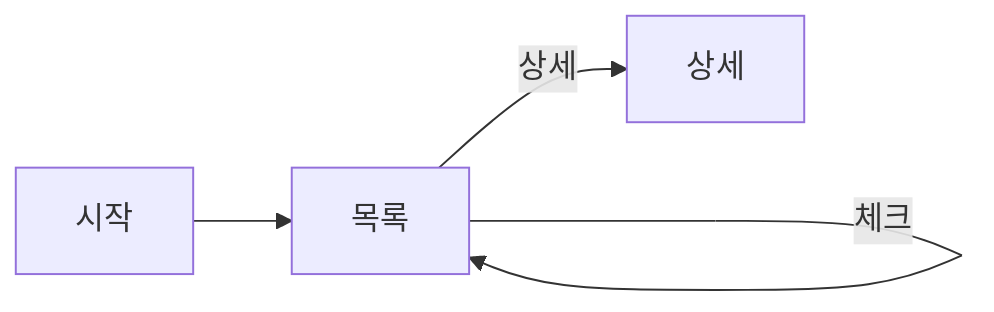

# DEV-25 화면정의서 — 습관 목록

| 필드 | 값 |
|---|---|
| 상태 | draft |
| 코드 | DEV-25 |
| 마지막 갱신 | 2026-09-01 |
| 범위 | HabitCheck v1 관련 |
| 비범위 | 해당 유형 밖 상세 |
| 관련 문서 | 본문 ○ 참고 |

## ＊ 화면 목적
습관 목록을 보고 오늘 체크한다.

## ＊ 진입·이탈
| 구분 | 경로 |
|---|---|
| 진입 | 앱 시작 |
| 이탈 | 습관 상세 / 추가 화면 |

## ＊ 주요 UI 요소
| 요소 | 동작 |
|---|---|
| 습관 행(이름, 오늘 체크) | 오늘 체크한다 |
| 추가 버튼 | 습관 상세 / 추가 화면 |
| 주간 요약 진입 | 미결 |

## ＊ 상태
| 상태 | 사용자에게 보이는 것 |
|---|---|
| 로딩 | 스켈레톤 |
| 빈 화면 | 첫 습관 추가 CTA |
| 에러 | 로컬 DB 오류 메시지 |

## ○ 흐름 (Mermaid)

## □ 시안
| 종류 | 링크 |
|---|---|
| 시안 | 없음 |

## 미결
| ID | 내용 |
|---|---|
| 1 | 빈 화면 카피 → DEV-28 |
