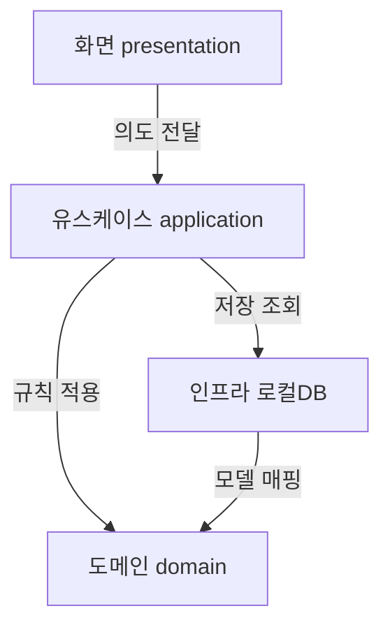
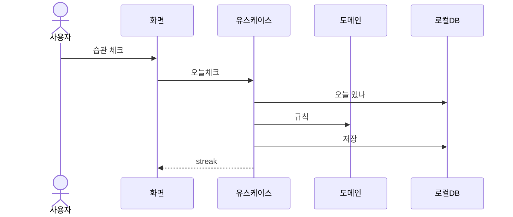

# DEV-30 구조명세서 — HabitCheck

| 필드 | 값 |
|---|---|
| 상태 | draft |
| 코드 | DEV-30 |
| 마지막 갱신 | 2026-09-03 |
| 범위 | 레이어·의존·로컬 데이터·오늘 체크 흐름 |
| 비범위 | REST, UI 카피, 스토어, DB 엔진 근거(DEV-50) |

## ＊ 한 줄 구조 요약
화면은 유스케이스만 호출하고, 유스케이스가 도메인과 로컬 저장소를 조율하는 단방향 의존 구조다.

## ＊ 모듈/레이어
| 모듈 | 책임 | 비고 |
|---|---|---|
| 화면 presentation | 목록·상세·체크 UI | 유스케이스만 호출 |
| 유스케이스 application | 추가·오늘체크·streak 조회 | 한 의도=한 유스케이스 |
| 도메인 domain | Habit·CheckIn, streak·날짜 경계 | 규칙 적용 |
| 인프라 infrastructure | 로컬 DB, 마이그레이션, 시계 | 저장 조회·모델 매핑 |

## ＊ 구조도 (Mermaid)

## ＊ 의존 규칙
| 방향 | 허용? | 설명 |
|---|---|---|
| 화면 → 유스케이스 | 허용 | 화면은 유스케이스만 호출 |
| 유스케이스 → 도메인/인프라 | 허용 | 유스케이스가 도메인과 로컬 저장소를 조율하는 단방향 의존 |
| 인프라 → 도메인 매핑 | 허용 | 모델 매핑 |
| 화면 → DB/파일 | 금지 | 화면은 유스케이스만 호출 |
| 도메인 → Flutter UI/플러그인 | 금지 | 단방향 의존 구조 |

## ＊ 건드리기 위험 구역
| 모듈 | 이유 | 경로(□) |
|---|---|---|
| 도메인 streak·날짜 | 자정/타임존이 연속 일수와 직결 | `lib/domain/streak.dart` |
| 인프라 마이그레이션 | 실패 시 로컬 데이터 손실 | `lib/infrastructure/db/migrations/` |

## ○ 핵심 실행 흐름
| 단계 | 행위자 | 행동 |
|---|---|---|
| 1 | 사용자 | 습관 체크 |
| 2 | 화면 | 오늘체크(habitId) |
| 3 | 유스케이스 | 오늘 체크인 조회→생성→streak |

## ○ 데이터 위치
| 데이터 | 위치 |
|---|---|
| 습관·체크인 | 기기 로컬 DB 한곳 |
| 화면 상태 | 메모리 |
| 계정·원격 | v1 없음 |

## ○ 관련 문서
| 코드 | 경로 |
|---|---|
| DEV-10 | `_examples/DEV-10-개요서.HabitCheck.md` |
| DEV-35 | 미작성 |
| DEV-50 | 미작성 |
| DEV-65 | `_examples/DEV-65-테스트명세서.HabitCheck.md` |

## 미결
| ID | 내용 |
|---|---|
| 1 | 로컬 DB 구현체 → DEV-50 |
