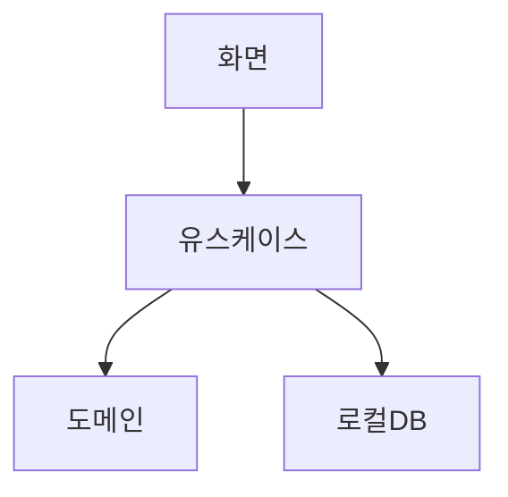

# DEV-30 구조명세서 — HabitCheck

| 필드 | 값 |
|---|---|
| 상태 | draft |
| 코드 | DEV-30 |
| 마지막 갱신 | 2026-09-09 |
| 범위 | 레이어·의존 |
| 비범위 | REST |

## ＊ 한 줄 구조 요약
화면은 유스케이스만 호출하고 단방향으로 도메인·로컬DB를 조율한다.

## ＊ 모듈/레이어
| 모듈 | 책임 | 비고 |
|---|---|---|
| 화면 | UI | presentation |
| 유스케이스 | 의도 처리 | application |
| 도메인 | streak 규칙 | domain |
| 인프라 | 로컬 DB | infrastructure |

## ＊ 구조도 (Mermaid)

## ＊ 의존 규칙
| 방향 | 허용? | 설명 |
|---|---|---|
| 화면 → 유스케이스 | 허용 | 규칙 |
| 화면 → DB | 금지 | 우회 금지 |

## ＊ 건드리기 위험 구역
| 모듈 | 이유 | 경로(□) |
|---|---|---|
| 도메인 streak | 날짜 경계 | `lib/domain/streak.dart` |

## ○ 핵심 실행 흐름
| 단계 | 행위자 | 행동 |
|---|---|---|
| 1 | 사용자 | 체크 |
| 2 | 유스케이스 | 저장·streak |

## ○ 데이터 위치
| 데이터 | 위치 |
|---|---|
| 습관·체크인 | 로컬 DB |

## ○ 관련 문서
| 코드 | 경로 |
|---|---|
| DEV-10 | 있음 |
| DEV-65 | 있음 |
| DEV-35 | 샘플 |
| DEV-50 | 샘플 |

## 미결
| ID | 내용 |
|---|---|
| — | 없음 |
