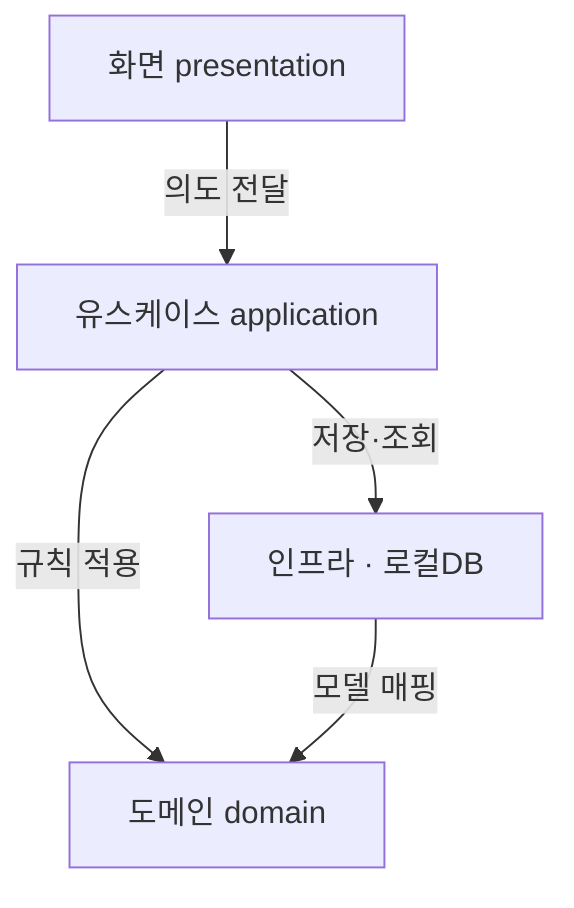
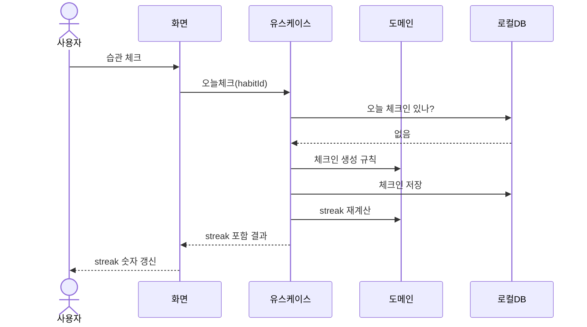

# DEV-30 구조명세서 — HabitCheck

- **상태:** draft
- **코드:** DEV-30
- **마지막 갱신:** 2026-09-01
- **범위:** HabitCheck v1의 레이어·모듈 경계, 의존 방향, 로컬 데이터 위치, “오늘 체크” 실행 흐름
- **비범위:** REST API, 화면 문구(UI 카피), 스토어 제출, 위젯 트리·스타일 상세, DB 엔진 최종 선정 근거(→ DEV-50)
- **관련 문서:** 본문 ○ 관련 문서 절 참고

## ＊ 한 줄 구조 요약
화면은 유스케이스만 호출하고, 유스케이스가 도메인 규칙과 로컬 저장소를 조율하는 **단방향 의존** 구조다.

## ＊ 모듈/레이어
| 이름 | 책임 |
|---|---|
| 화면 (`presentation`) | 습관 목록·상세·체크 UI. 입력을 유스케이스 호출로만 전달 |
| 유스케이스 (`application`) | 습관 추가, 오늘 체크, streak 조회 등 한 건의 사용자 의도 처리 |
| 도메인 (`domain`) | Habit·CheckIn 의미와 streak·날짜 경계 규칙 |
| 인프라 (`infrastructure`) | 로컬 DB 읽기/쓰기, 마이그레이션, 시계(오늘 날짜) 제공 |

## ＊ 구조도 (Mermaid)
<!-- language=ko — 표시 라벨 한글. 코드 모듈명은 병기 -->

## ＊ 의존 규칙
- 허용: 화면 → 유스케이스 → 도메인 / 인프라
- 허용: 인프라가 도메인 모델로 매핑
- 금지: 화면이 로컬 DB·파일에 직접 접근
- 금지: 도메인이 Flutter UI·플러그인을 import

## ＊ 건드리기 위험 구역
- **도메인** streak·날짜 경계 — 자정/타임존 오류가 연속 일수 신뢰와 직결  
  - □ 경로: `lib/domain/streak.dart`
- **인프라** DB 마이그레이션 — 실패 시 로컬 습관·체크인 손실  
  - □ 경로: `lib/infrastructure/db/migrations/`

## ○ 핵심 실행 흐름
오늘 체크:

## ○ 데이터 위치
- 습관·체크인: 기기 **로컬 DB** 한곳
- 화면 로딩/선택 상태: **메모리**만
- 계정·원격 서버: **없음** (v1)

## ○ 관련 문서
- DEV-10 개요서: `sample-loop-1/DEV-10-개요서.md`
- DEV-35 데이터모델명세서: `미작성`
- DEV-50 기술결정기록 (DB·타임존): `미작성`
- DEV-65 테스트명세서: `_examples/DEV-65-테스트명세서.HabitCheck.md`

## 미결
- [ ] 로컬 DB 구현체 (예: sqflite / drift) → DEV-50
- [ ] 자정·타임존 기준 (기기 로컬 vs 고정)
- [ ] DEV-35로 테이블·필드 분리 작성
