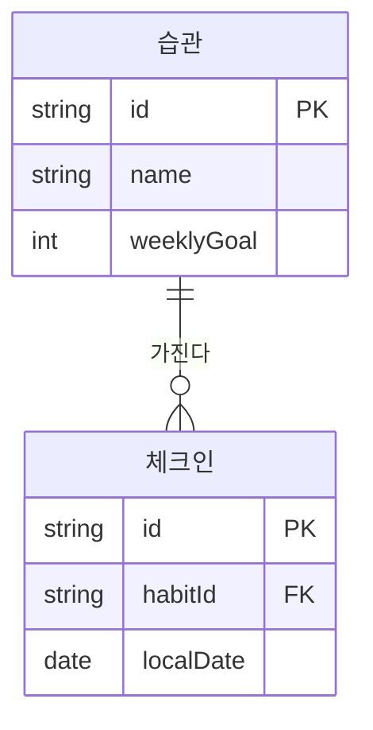

# DEV-35 데이터모델명세서 — 습관·체크인

- **상태:** draft
- **코드:** DEV-35
- **마지막 갱신:** 2026-09-01
- **범위:** Habit·CheckIn 로컬 모델
- **비범위:** API, 원격 동기화
- **관련 문서:** 본문 ○ 참고

## ＊ 개요
로컬 DB에 습관과 일자별 체크인을 저장한다.

## ＊ 모델
| 엔티티/필드 | 타입 | 제약 | 설명 |
|---|---|---|---|
| Habit.id | UUID | PK | |
| Habit.name | text | not null | |
| Habit.weeklyGoal | int | ≥1 | 주당 목표 |
| CheckIn.id | UUID | PK | |
| CheckIn.habitId | UUID | FK | |
| CheckIn.localDate | date | unique(habitId,localDate) | 기기 로컬 일자 |

## ＊ 관계 (Mermaid)

## ○ 수명·삭제
- 습관 삭제 시 체크인 cascade (미결: soft delete 여부)

## ○ 관련 문서
- DEV-30, DEV-50

## 미결
- [ ] soft delete
